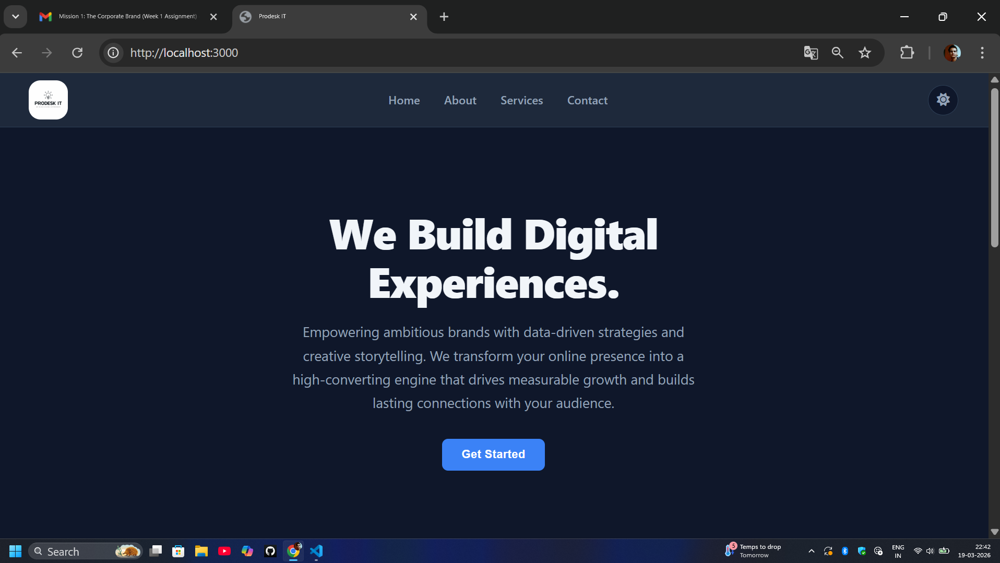
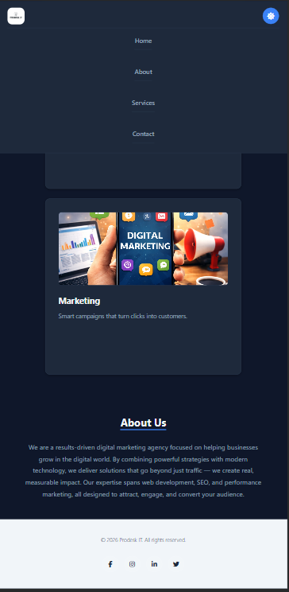

# 🚀 Prodesk IT — Digital Marketing Agency Landing Page


> A clean, modern, and fully responsive landing page for a digital marketing agency — built with pure HTML, CSS, and JavaScript. Designed to showcase services, build trust, and drive conversions.

---

## 📸 Screenshots

| Desktop View | Mobile View |
|---|---|
|  |  |

> 📁 Add your own screenshots to the `/screenshots` folder to populate the table above.

---

## ✨ Features

- 🌗 **Dark / Light Mode Toggle** — Seamless theme switching with persistent user preference
- 📱 **Fully Responsive** — Optimized layouts for mobile, tablet, and desktop screens
- 🎯 **Hero Section** — Bold headline, subtext, and a clear call-to-action
- 🛠️ **Services Section** — Highlights core digital marketing offerings with icons and cards
- 🏢 **About Section** — Agency story, mission, and value proposition
- 🔗 **Footer** — Navigation links, social icons, and contact info
- ✨ **Hover Effects & Animations** — Smooth transitions and micro-interactions throughout
- 🎨 **Consistent Design System** — Unified color palette, spacing scale, and typography

---

## 🛠️ Tech Stack

| Technology | Purpose |
|---|---|
| **HTML5** | Page structure and semantic markup |
| **CSS3** | Styling, animations, Flexbox & Grid layouts |
| **JavaScript (Vanilla)** | Dark/light mode toggle, interactivity |

> No frameworks. No dependencies. Just clean, handcrafted code.

---

## 📁 Folder Structure

```
prodesk-it/
│
├── index.html              # Main HTML file
│
├── css/
│   └── style.css           # All styles, variables, and media queries
│
├── js/
│   └── script.js           # Theme toggle and interactivity
│
├── assets/
│   └── images/             # Icons, logos, and visual assets
│
├── screenshots/
│   ├── desktop.png         # Desktop preview
│   └── mobile.png          # Mobile preview
│
├── Prompts.md              # AI prompts used during development
└── README.md               # Project documentation
```

---

## ⚙️ Setup Instructions

Getting this project running locally takes less than a minute — no installs required.

**1. Clone the repository**
```bash
git clone https://github.com/your-username/prodesk-it.git
```

**2. Navigate into the project folder**
```bash
cd prodesk-it
```

**3. Open in your browser**

Simply open `index.html` directly in any modern browser:
```bash
# On macOS
open index.html

# On Windows
start index.html

# Or just drag index.html into your browser window
```

> 💡 For the best development experience, use the [Live Server](https://marketplace.visualstudio.com/items?itemName=ritwickdey.LiveServer) extension in VS Code.

---

## 🧠 Learnings

Building this project reinforced and introduced several key concepts:

- **CSS Custom Properties** — Used CSS variables (`--primary-color`, `--bg-color`, etc.) to power the entire design system and enable smooth dark/light mode switching
- **Responsive Design Patterns** — Applied Flexbox and CSS Grid to build layouts that adapt gracefully across all screen sizes
- **JavaScript DOM Manipulation** — Implemented theme toggling by dynamically adding/removing classes and saving preference to `localStorage`
- **Visual Hierarchy** — Learned how to use typography scale, spacing, and color contrast to guide the user's eye through the page
- **Semantic HTML** — Used proper tags (`<header>`, `<main>`, `<section>`, `<footer>`) for accessibility and SEO

---

## 🔮 Future Improvements

- [ ] Add a **Contact Form** with client-side validation
- [ ] Integrate **EmailJS** or **Formspree** for form submission
- [ ] Add a **Testimonials / Reviews** section with a carousel
- [ ] Implement **scroll-triggered animations** using the Intersection Observer API
- [ ] Add a **Blog / Insights** section
- [ ] Improve **accessibility** (ARIA labels, keyboard navigation, focus states)
- [ ] Deploy on **GitHub Pages** or **Netlify** for a live URL

---

## 🤖 AI Usage

This project was developed with the assistance of AI tools to accelerate learning and ideation.

All AI prompts used during development are documented in [`Prompts.md`](./Prompts.md), including:
- Design direction and layout planning prompts
- CSS animation and transition snippets
- Debugging assistance for responsive breakpoints
- Copywriting suggestions for section headings and descriptions

> AI was used as a **learning aid and productivity tool** — all code was reviewed, understood, and manually integrated by the developer.

---

## 📬 Contact

**Developed by:** Yogesh kashyap
**Email:** 22cse154yogesh@eitfaridabad.co.in
**LinkedIn:** [linkedin.com/in/yourprofile](https://linkedin.com/in/yogesh2002kashyap)
**GitHub:** [github.com/your-username](https://github.com/yogesh2002kashyap)

---

<div align="center">

⭐ If you found this project useful or interesting, consider giving it a star!

Made with ❤️ and lots of ☕

</div>